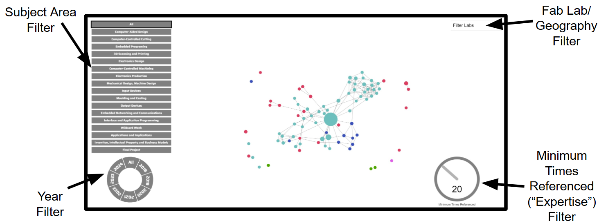

# Expert Network Map

***This is a copy of the Expert Network Map GitLab repo to be submitted as a part of my (Adam Stone's) MIT Maker Portfolio.***

## Project Overview

The *Expert Network Map* allows users to visually identify *Topic Experts* in the Fab community. *Topic Experts* are Fab Academy students who are frequently referenced by peers. Fab Academy students often link each other's websites in their documentation, and mapping these connections creates a network intertwined across labs, years, and countries. The more times a student is referenced correlates with expertise level in specific subject areas. For current Fab Academy students, it can be extremely helpful to quickly identify *Topic Experts* to access their documentation for reference. Interacting with the Map can help students locate *Topic Experts* for specific years and labs. Once *Topic Experts* are found, clicking on their circle redirects the user to their Fab Academy Documentation Website.
 
The *Expert Network Map* allows users to navigate the massive web of interconnected students and highlights *Topics Experts* dating back to 2018. Each Fab Academy student is represented by a circle. Drag around different students to play with the data and gain insight into the interconnectedness of the Fab community.

The larger students' circles, the more times they have been referenced. Hover over circles to see students' names, and click on them to open their documentation website. Click the tabs on the left to filter by topic area; click different years on the bottom left circle to highlight students from that year; use the dropdown on the top right to highlight students from certain Fab Labs; and use the dial on the bottom right to set a minimum number of references that a student must have, changing the *Expertise Threshold*.

## Project Details

### Live Site

Access the live visualization website used by over 500 Fab Academy students.

[https://adamnstone.github.io/ExpertNetworkMap-ANS/public/](https://adamnstone.github.io/ExpertNetworkMap-ANS/public/)

*(Use Chrome on a Computer)*

### Detailed Code Documentation

Read about the development process and explanation of all of the project's code.

[Access the documentation here!](https://adamnstone.com/stem/expert-network-map/)

### Fab23 International Conference and Symposium Presentation

The project was launched at the [`2023 International Fab Lab Conference and Symposium`](https://fab23.fabevent.org/), the largest digital fabrication event in the world. Find recordings of the presentation below.

[Recording link](https://drive.google.com/file/d/1bEBDj8PmzUHJm77vQDSpTuwRIUYbdzOo/view?usp=drive_link)

[Livestream link (1:40:45-1:51:50)](https://www.youtube.com/watch?v=DSM94J2tzmc)

### MatterMost Channel

Join an online group to get involved in building off of or brainstorming new use cases for the Expert Network Map.

[Access the MatterMost Channel here!](https://chat.academany.org/fabacademy-2023/channels/fab-academy-data-viz)

### Release Notes

Read the details of older release notes for early versions of the project.

[Access the changes for each iteration here!](./documentation.md)

## Getting Started

### How to run the visualization

1. Clone repo
2. Run `python -m http.server` in the root directory of the cloned repo
3. Navigate to [`localhost:8000/public`](http://localhost:8000/public/) in Google Chrome

## Repo Organization

- Visualization
    - Interactive force simulation graph where nodes represent students and edges represent references between students' documentation
    - Size of nodes corresponds to level of expertise (calculated by in-degree centrality)
    - Color of nodes corresponds to geography
    - Four filters enable users to quickly search for useful documentation by "expertise" level, subject area, geography / Fab Lab, and year
    - Code in [`public`](./public/) directory
    - Minified code is stored in [`public/combined.js`](./public/combined.js)
- Data Scraping (automatically runs weekly to collect new data as Fab Academy students create new documentation)
    - Data Collection Python Scripts
        - Scrape 1,000+ Fab Academy student GitLab repos and searches for URLs to other students' documentation websites
        - Store the 2,000 characters of text surrounding each link to use for classifying each reference into a subject area
        - References that have the exact name of a subject area in the surrounding text are automatically classified, then used as training data for the classification neural network
        - Code on the [`pipeline_testing`]**FIX URL** branch in the [`update-data`]**FIX URL** directory
    - AI Classification Python Scripts
        - Train a neural network on keyword-classified references between students' documentation (~86.3% accuracy)
        - Use the neural network to classify each of the remaining references into a subject area
        - Code on the [`pipeline_testing`]**FIX URL** branch in the [`update-data`]**FIX URL** directory